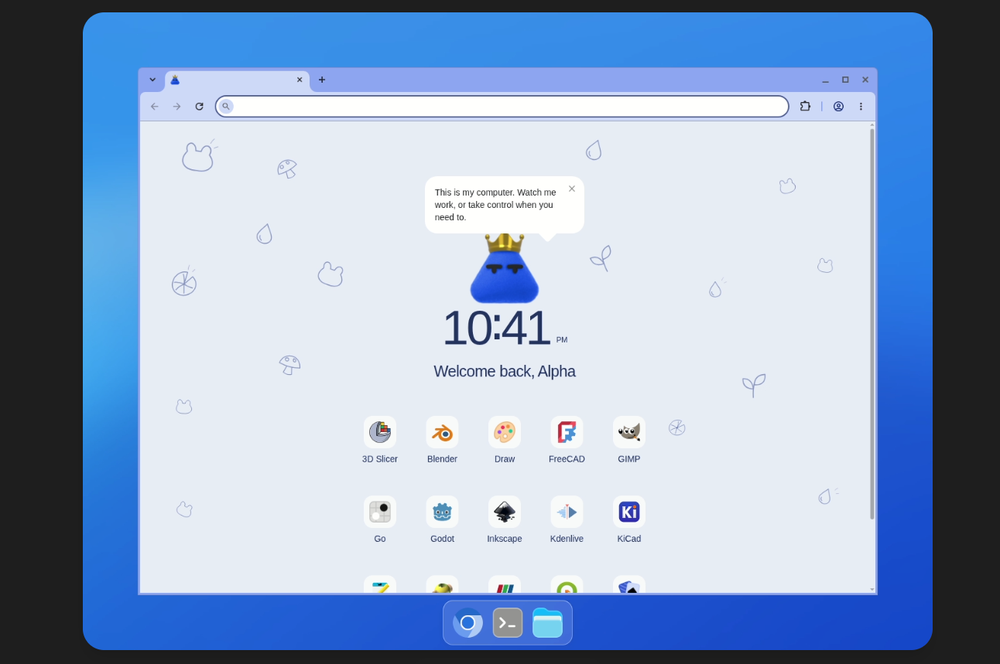
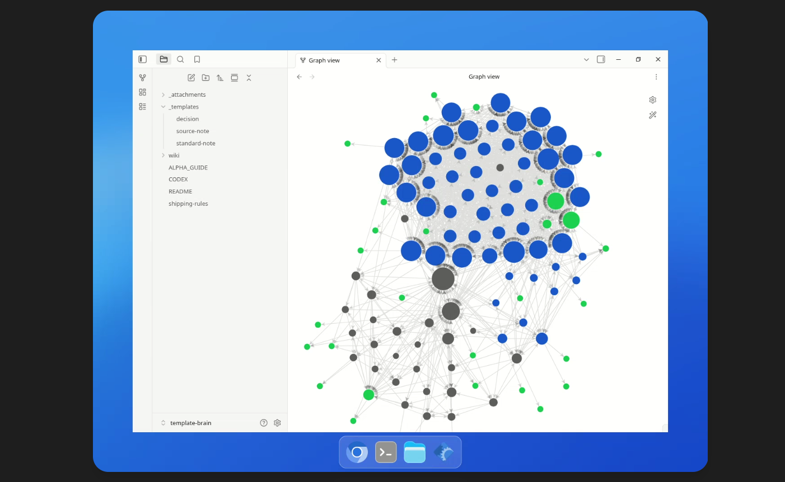

# Dots Second Brain

A source-backed Obsidian second brain for a personal agent on **OpenAI dots**.
It collects what is known about dots (access, the cloud computer, context and
schedules, safety controls, skills and plugins), how to keep an agent's vault
durable, and the open questions that still need testing. Every claim links to
a dated source page and a hashed capture.

<p align="center">
  
  
</p>
<p align="center"><em>Left: Alpha, the dot this vault was built for. Right: the vault's graph in Obsidian.</em></p>

## Use it

1. Clone or download this repository.
2. Open the folder as a vault in Obsidian. No community plugins are needed, and
   Restricted mode is fine.
3. Start at `wiki/overview.md`, then `wiki/index.md`.

Research snapshot: 2026-10-01. Dots change quickly, so recheck anything
time-sensitive against the linked official pages.

## What's inside

```
inbox/              drop new sources here to ingest
.raw/               original captures, never edited; hashes in .manifest.json
wiki/
  hot.md            short recent context for agents
  index.md          catalog of every page
  log.md            completed operations, newest first
  overview.md       what the vault is for and where to start
  sources/          14 source pages with hashes and refresh dates
  concepts/         access, cloud computer, context, safety, skills, storage
  entities/         OpenAI Dots, Alpha, Obsidian
  questions/        what is answered, what is proposed, what is untested
  comparisons/      where a vault should live
  canvases/         visual map
  meta/             vault guide, research map and review
AGENTS.md           rules for any agent working in the vault
```

## Use it with an agent

Point your agent at this folder and `AGENTS.md`. It reads `wiki/hot.md`, then
`wiki/index.md`, then the relevant pages and their sources. Four routines keep
the vault healthy: ingest, query, save and lint, described in
`wiki/meta/Vault Guide.md`.

Nothing is recorded automatically. The agent offers to save an outcome after
meaningful work, and you choose what is kept.

**With a dot.** A dot does not load folders on its own. Name the vault path and
read order in the task or saved-schedule prompt. See
`wiki/questions/Can a dot load this vault automatically.md`.

## License

MIT, see [LICENSE](LICENSE). Linked pages remain under their owners' terms; the
vault stores short original summaries and links only.
